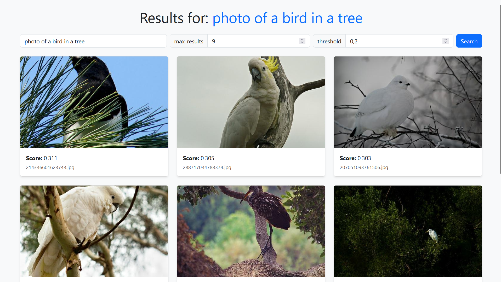
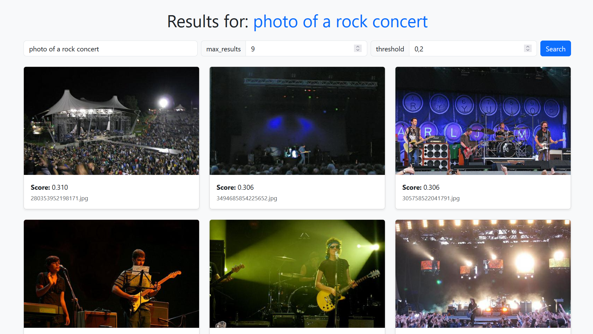
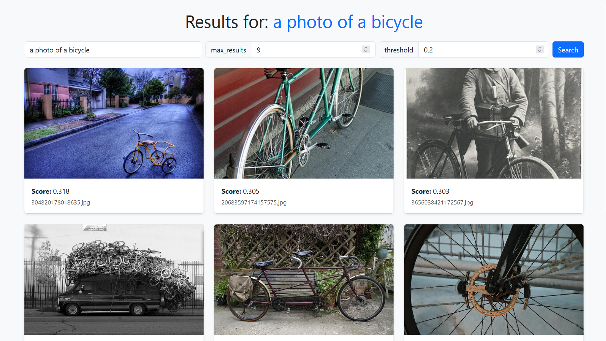

# image-search

.
## Presentation

**image-search** est un moteur de recherche d’images basé sur la similarité sémantique entre texte et image.  
Ce projet met en œuvre le modèle **CLIP d’OpenAI**, qui permet de comparer directement une requête textuelle et des images en les projetant dans un même espace d’embeddings.

L’objectif est de proposer une API web performante et une interface simple pour explorer la recherche d’images par description sémantique. L'application est **déployée sur un instance d'AWS EC2** et est **disponible à cette [adresse](http://16.171.6.178:8000/)**.





## Comment ca fonctionne ?

1. L'utilisateur soumet une requête textuelle via l'API web.
2. Le modèle ClipText génère un embedding pour cette requête.
3. Cet embedding est comparé aux embeddings d'images pré-calculés et préalablement téléchargés depuis le bucket S3 au démarrage de l'application.
4. La similarité entre embeddings est évaluer grâce à la distance cosinus.
5. Les meilleurs résultats sont sélectionnés, puis une requête est envoyée au cloud AWS pour télécharger les images correspondantes. Ces images sont enfin affichées sur l'API web.

.

## Stack technique

* **AWS EC2** : Hébergement du serveur et déploiement de l’application dans le cloud.
* **AWS S3** : Les embeddings et les images sont stockés sur S3, avec l’API Python **Boto3** pour automatiser l’upload et le téléchargement des fichiers.
* **Docker** : Conteneurisation de l’application pour simplifier le déploiement et la reproductibilité de l’environnement.
* **transformers (Hugging Face)** : Librairie utilisée pour importer et exploiter le modèle CLIP, basée sur **PyTorch**.
* **FastAPI** : FastAPI permet de rapidement creer API web. J'y ai également ajouté du code HTML dynamiquement généré avec **Jinja2**.
* **systemd** : Gestionnaire de services Linux pour garantir la disponibilité continue de l’application sur le serveur.

## Installation et configuration

### prerequis

* Git
* Docker
* Un compte AWS avec accès à EC2
* Un bucket AWS S3 avec une base d'images et leurs embeddings clip

### installation avec docker

1. Clonez le projet

```shell
git clone https://github.com/ton-utilisateur/image-search.git
cd image-search
```

2. Creez un fichier `.env` à la racine du projet, avec les informations d'accès à votre bucket S3.

```shell
ENDPOINT_URL=...
BUCKET_NAME=...
AWS_ACCESS_KEY_ID=...
AWS_SECRET_ACCESS_KEY=...
```

3. Construisez l'image docker et lancez un conteneur

```shell
docker build -t image-search .
docker run -it --env-file .env -p 8000:80 image-search bash
```

### lancement en local

Depuis votre conteneur, lancer la commande uvicorn

```shell
uvicorn main:app --host 0.0.0.0 --port 8000
```

Puis dans votre navigateur, allez à l'adresse `http://localhost:8000/`. L'application apparait !

### Déploiement sur le cloud

todo : completer

## Points techniques à noter

### Optimisation

Étant donné que la RAM est limité à 1Go sur AWS EC2 et que la latence est importante pour l'expérience utilisateur, l'application doit être optimisé :

* Une seule prédiction est effectuée par requête, grace aux embeddings image pré-caclculés.
* La distance cosinus est calculée via une multiplication vectorisée, accélèrant le traitement.
* Seules les images à afficher sont chargées en mémoire, limitant la consommation de RAM au nécessaire.

## Limitations

* **CLIP n'est pas calibré** : Les scores de similarité de CLIP ne représentent pas une probabilité (d'ailleurs ils sont entre 0.1 et 0.35). Il est entraîné par apprentissage contrastif pour rapprocher les textes et images associés, et non pas pour mesurer la pertinence absolue. **Une requête sans sens produira des correspondances**, car le modèle cherche toujours l’appariement le plus proche.

* **Nombre d’images** : Le projet utilise 50 000 images d’ImageNet, limité par l'espace disponible sur AWS. La pertinence du matching dépend de la taille de la base. Une requête comme "a drawing of a football player fighting with a cheese" ne donnera aucun résultats pertinents, simplement parce que ce type de contenu n’existe pas dans base de données.
